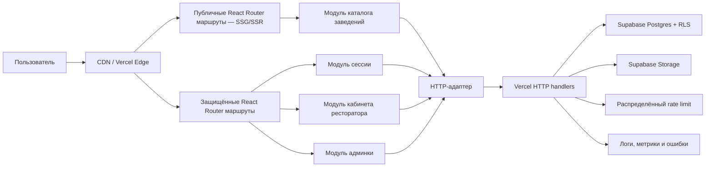

# План миграции Mesto на React, TypeScript и React Router Framework Mode

Дата: 4 августа 2026 года  
Статус: предлагаемый план  
Область: публичный сайт, личный кабинет, кабинет ресторатора, административная панель и связанная эксплуатационная готовность

## 1. Краткое решение

Проект следует постепенно перевести на следующий основной frontend-стек:

- React;
- TypeScript в строгом режиме;
- React Router Framework Mode;
- Vite как часть toolchain React Router;
- Vitest и React Testing Library для модульных тестов;
- Playwright для сквозных браузерных тестов.

Не следует одновременно внедрять Next.js, Astro, Vue, Svelte или второй UI-фреймворк. Это не усилит проект, а создаст несколько способов маршрутизации, загрузки данных, сборки и тестирования.

Миграция должна быть постепенной, с сохранением существующих HTTP-маршрутов, базы Supabase, визуальной системы и рабочих пользовательских сценариев. Старые страницы удаляются только после достижения функционального паритета и прохождения автоматических тестов.

React нужен проекту не ради моды. Сейчас состояние интерфейса вручную синхронизируется с DOM в больших файлах `app.js`, `merchant.js` и `admin.js`. React позволит описывать интерфейс как функцию состояния, локализовать изменения и тестировать поведение через стабильные интерфейсы модулей.

### Неприкосновенное требование: Visual Freeze

Миграция является технической заменой реализации, а не редизайном. Пользователь не должен заметить, что сайт был переписан на React.

Без отдельного письменного согласования запрещено изменять:

- композицию и порядок секций;
- размеры, сетку, отступы и выравнивание;
- цвета, градиенты, тени, рамки и скругления;
- шрифты, начертания, размеры текста и высоту строк;
- тексты, подписи, иконки, изображения и порядок контента;
- поведение hover, focus, active, disabled, loading и error states;
- анимации, длительность и характер переходов;
- desktop, tablet и mobile breakpoints;
- видимое поведение меню, карточек, фильтров, форм и диалогов.

Допустимы внутренние изменения DOM, семантики и модулей, если визуальный результат и пользовательское поведение остаются эквивалентными. Любое намеренное видимое улучшение выносится в отдельную задачу после миграции.

Гарантия обеспечивается не обещанием разработчика, а baseline-снимками legacy-сайта, автоматическим visual regression, ручным сравнением preview и одобрением владельца перед переключением production.

## 2. Важное уточнение о «тысячах пользователей»

Фраза «сайт рассчитан на тысячи пользователей» недостаточна для точного capacity planning. Тысяча зарегистрированных пользователей, тысяча посетителей в день и тысяча одновременных соединений — принципиально разные нагрузки.

До появления реальной аналитики принимается рабочая гипотеза:

- несколько тысяч зарегистрированных пользователей;
- до 1 000 активных пользователей в день;
- штатная нагрузка до 100 одновременно активных пользователей;
- кратковременный всплеск до 300 одновременно активных пользователей;
- публичное чтение каталога существенно преобладает над записью;
- каталог может вырасти до десятков тысяч заведений, отзывов и связанных записей.

Это не обещание автоматически выдержать 1 000 одновременных пользователей. Если бизнес-требование означает именно 1 000 одновременных пользователей, перед запуском нужен отдельный нагрузочный профиль, тест инфраструктуры и проверка лимитов Vercel и Supabase.

React отвечает за управляемость интерфейса. Масштабирование для тысяч пользователей обеспечивают также кеширование, эффективные запросы, распределённый rate limit, индексы базы, пагинация, наблюдаемость и нагрузочное тестирование.

## 3. Что есть сейчас

### 3.1. Frontend

- `index.html` и `app.js` реализуют публичную часть.
- `merchant.html` и `merchant.js` реализуют кабинет ресторатора.
- `admin.html` и `admin.js` реализуют административную панель.
- Состояние, HTTP-запросы, разметка и DOM-обработчики смешаны в одних файлах.
- Повторяются функции запросов, уведомлений, форматирования и управления представлениями.
- Крупные фрагменты разметки собираются через `innerHTML`.
- Полноценных тестов пользовательского интерфейса почти нет.

### 3.2. Backend

- Vercel направляет `/api/*` в `api/router.js`.
- Существуют отдельные обработчики публичного каталога, авторизации, избранного, отзывов, загрузок, кабинета ресторатора и админки.
- Supabase используется как хранилище и источник пользовательских данных.
- В схеме уже есть RLS и часть полезных индексов.

### 3.3. Найденные ограничения для роста

1. Rate limit в `lib/rate-limit.js`, `handlers/venues.js`, `handlers/uploads.js` и некоторых обработчиках входа хранится в локальном `Map`. На serverless-платформе разные экземпляры функции не разделяют эту память. Ограничение может быть непоследовательным, а перезапуск процесса сбрасывает счётчики.
2. `lib/http.js` всегда выставляет `Cache-Control: no-store`. Он делает это после применения пользовательских заголовков, поэтому публичный кеш фактически может быть отключён даже там, где обработчик пытается задать `s-maxage`.
3. Публичный поиск использует wildcard `ILIKE` сразу по нескольким полям и `count=exact`. При росте каталога это нужно проверить через `EXPLAIN ANALYZE` и при необходимости заменить полнотекстовым или trigram-поиском.
4. Пагинация каталога основана на `offset`. Для глубоких страниц и большого каталога предпочтительнее курсорная пагинация по стабильному составному ключу.
5. Нет зафиксированных SLO, нагрузочного профиля, метрик ошибок и автоматической проверки производительности перед релизом.

## 4. Цели миграции

### 4.1. Функциональные цели

- Сохранить все существующие пользовательские сценарии.
- Добавить адресуемые маршруты публичных страниц, кабинета ресторатора и админки.
- Сделать загрузку, ошибки, пустые результаты и повторные попытки явными состояниями интерфейса.
- Сохранить авторизацию, OAuth, избранное, заявки, отзывы, меню, акции и модерацию.
- Сохранить текущий интерфейс в режиме Visual Freeze: без намеренных изменений внешнего вида, контента, анимаций и адаптивного поведения.

### 4.2. Архитектурные цели

- Разделить отображение, прикладное поведение и транспорт HTTP.
- Сформировать глубокие модули с маленькими интерфейсами.
- Убрать знание URL, HTTP-методов, заголовков и сырых форматов ошибок из React-маршрутов.
- Получить один источник истины для каждого изменяемого состояния.
- Проверять критические сетевые данные во время выполнения, а не полагаться только на TypeScript.
- Избежать глобального store до появления доказанной необходимости.

### 4.3. Эксплуатационные цели

- Поддерживать рост до нескольких тысяч пользователей без смены всей архитектуры.
- Кешировать безопасные публичные ответы на CDN.
- Не кешировать персональные и административные ответы.
- Использовать распределённый rate limit в production.
- Иметь автоматические сквозные и нагрузочные проверки.
- Иметь наблюдаемость, понятные ошибки и процедуру отката.

## 5. Что не является целью

- Полный редизайн сайта.
- Любые «попутные улучшения» внешнего вида во время технической миграции.
- Одновременная замена backend, Supabase и frontend.
- Перенос всех Vercel-функций в новый server framework без отдельного обоснования.
- Добавление Redux, Zustand, Tailwind, Material UI или другого крупного UI-kit «на будущее».
- Использование экспериментальных или beta-зависимостей в production.
- Механическая конвертация каждого старого файла в один огромный React-файл.

## 6. Почему выбран этот стек

### React

React делает состояние владельцем интерфейса. Когда меняется фильтр, пользователь, выбранное заведение или результат сохранения, React вычисляет нужное представление. Не требуется вручную находить и синхронно изменять несколько DOM-узлов.

Практическая польза для Mesto:

- карточка заведения имеет одну реализацию для разных списков;
- диалог, уведомление, пагинация и состояния формы переиспользуются;
- состояние меню и акций локализуется рядом с соответствующим маршрутом;
- исчезает значительная часть ручных `querySelector`, `innerHTML` и `addEventListener`;
- тесты работают с поведением пользователя, а не с внутренней последовательностью DOM-команд.

### TypeScript

TypeScript нужен для контрактов заведений, профилей, ролей, меню, акций, отзывов и результатов HTTP-запросов. Он уменьшает число ошибок при рефакторинге и делает зависимости модулей видимыми.

`strict` должен быть включён с начала новой реализации. Нельзя сначала написать проект на нестрогом TypeScript, а потом надеяться «добавить типы».

### React Router Framework Mode

Framework Mode выбран вместо ручной сборки набора библиотек. Он даёт:

- файловую или конфигурационную маршрутизацию;
- route loaders и actions;
- pending и error states;
- разделение кода по маршрутам;
- типизацию параметров маршрутов;
- SPA, SSR и статические стратегии рендеринга;
- Vite toolchain.

Для проекта это позволяет использовать предварительный рендеринг публичных страниц и защищённые интерактивные маршруты кабинетов в одной основной системе.

### Инструменты тестирования

- Vitest: быстрые тесты чистой логики и интерфейсов модулей.
- React Testing Library: проверка поведения React-интерфейса.
- Playwright: реальные сценарии в браузере, адаптивность и критические регрессии.
- Инструмент нагрузочного тестирования, например k6: отдельные профили публичного чтения, авторизации и записи.

## 7. Дополнительные библиотеки

### Добавить на первом этапе

- Стабильные версии `react` и `react-dom`.
- Стабильный React Router Framework Mode и его Vite toolchain.
- `typescript`.
- `vitest`.
- `@testing-library/react`, `@testing-library/user-event` и `@testing-library/jest-dom`.
- `@playwright/test`.
- Небольшую runtime-schema библиотеку, например Zod, для критических ответов HTTP и данных форм.

### Добавлять только по результатам миграции

- TanStack Query — если route loaders/actions недостаточны для фоновой синхронизации, сложного кеша, optimistic updates и повторного использования серверного состояния между далёкими маршрутами.
- Sentry или эквивалент — для frontend/backend error tracking после согласования внешнего сервиса и политики данных.
- Storybook — только если самостоятельная библиотека UI действительно начнёт обслуживать много экранов и команд.

### Не добавлять без отдельного решения

- Redux или Zustand: сначала использовать route data, URL state, локальное состояние и небольшой Context для сессии.
- React Hook Form: встроенных форм React Router и обычного `FormData` может быть достаточно; добавлять только при доказанной сложности форм.
- Tailwind: существующие CSS и design tokens нужно сначала сохранить и упорядочить.
- Next.js: он дублирует выбранный framework и потребует более широкой миграции.
- Astro: хороший кандидат для преимущественно статических сайтов, но здесь он создаст второй слой рядом с React Router.
- Vue, Nuxt, SvelteKit и Angular: это альтернативы React, а не дополнения к нему.

## 8. Целевая архитектура



### Основные правила

1. React-маршрут не должен знать точные URL backend, заголовки или сырую форму ошибок.
2. Интерфейс модуля описывает пользовательское намерение, например `saveVenue`, а не общий `request(path, options)`.
3. HTTP-адаптер преобразует сетевые ошибки в конечный набор типизированных ошибок приложения.
4. Loader/action отвечает за жизненный цикл маршрута, но прикладные правила остаются внутри модуля.
5. Авторизация и права повторно проверяются на сервере. Скрытая кнопка в React не является защитой.
6. Публичные данные могут кешироваться. Данные пользователя, ресторатора и администратора — нет.

## 9. Предлагаемая структура файлов

Точная структура может немного измениться под актуальные conventions стабильной версии React Router, но разделение ответственности должно сохраниться.

```text
app/
├── root.tsx
├── routes.ts
├── routes/
│   ├── public/
│   │   ├── home.tsx
│   │   ├── catalog.tsx
│   │   ├── city.tsx
│   │   ├── venue.tsx
│   │   └── help.tsx
│   ├── account/
│   │   ├── profile.tsx
│   │   └── favorites.tsx
│   ├── merchant/
│   │   ├── layout.tsx
│   │   ├── overview.tsx
│   │   ├── venue.tsx
│   │   ├── menu.tsx
│   │   ├── promotions.tsx
│   │   └── reviews.tsx
│   └── admin/
│       ├── layout.tsx
│       ├── overview.tsx
│       ├── submissions.tsx
│       ├── reviews.tsx
│       ├── venues.tsx
│       └── merchants.tsx
├── modules/
│   ├── session/
│   ├── venue-catalog/
│   ├── favorites/
│   ├── submissions/
│   ├── merchant-workspace/
│   └── admin-console/
├── adapters/
│   ├── http/
│   ├── browser-storage/
│   └── test-fakes/
├── ui/
│   ├── layout/
│   ├── venue-card/
│   ├── forms/
│   ├── dialog/
│   ├── toast/
│   ├── pagination/
│   └── feedback/
├── styles/
│   ├── tokens.css
│   ├── global.css
│   └── routes/
└── lib/
    ├── validation/
    ├── formatting/
    └── accessibility/

test/
├── unit/
├── integration/
└── contract/

e2e/
├── public-catalog.spec.ts
├── auth.spec.ts
├── merchant.spec.ts
└── admin.spec.ts

load/
├── public-catalog.js
├── auth.js
└── mixed-traffic.js
```

## 10. Карта маршрутов

### Публичные маршруты

- `/` — предварительно отрендеренная главная.
- `/catalog` — индексируемый каталог; фильтры хранятся в URL search params.
- `/city/:citySlug` — страница города, SSG или SSR.
- `/venue/:venueSlug` — индексируемая карточка заведения, SSR или revalidation.
- `/help` — статическая страница.
- `/login` и `/register` — пользовательская авторизация.
- OAuth callbacks остаются серверными HTTP-маршрутами.

### Пользовательские маршруты

- `/profile` — защищённый профиль.
- `/favorites` — защищённое избранное.

### Кабинет ресторатора

- `/merchant` перенаправляет на `/merchant/overview`.
- `/merchant/overview`.
- `/merchant/venue`.
- `/merchant/menu`.
- `/merchant/promotions`.
- `/merchant/reviews`.

### Административная панель

- `/admin` перенаправляет на `/admin/overview`.
- `/admin/overview`.
- `/admin/submissions`.
- `/admin/reviews`.
- `/admin/venues`.
- `/admin/merchants`.

## 11. Интерфейсы ключевых модулей

Ниже приведено направление, а не обязательная дословная форма типов.

```ts
export interface SessionModule {
  restore(): Promise<Session | null>;
  login(credentials: LoginInput): Promise<Session>;
  logout(): Promise<void>;
}

export interface VenueCatalogModule {
  search(input: VenueSearchInput): Promise<VenuePage>;
  getBySlug(slug: string): Promise<VenueDetails>;
}

export interface MerchantWorkspaceModule {
  load(): Promise<MerchantWorkspace>;
  selectVenue(venueId: string): Promise<MerchantVenue>;
  saveVenue(input: VenueUpdateInput): Promise<MerchantVenue>;
  saveMenuItem(input: MenuItemInput): Promise<MenuItem>;
  removeMenuItem(itemId: string): Promise<void>;
  savePromotion(input: PromotionInput): Promise<Promotion>;
  removePromotion(promotionId: string): Promise<void>;
}

export interface AdminConsoleModule {
  loadOverview(): Promise<AdminOverview>;
  moderateSubmission(id: string, decision: ModerationDecision): Promise<void>;
  moderateReview(id: string, decision: ModerationDecision): Promise<void>;
}
```

Если количество методов продолжит расти, модуль нужно разделить по реальным изменениям поведения. Не следует создавать отдельный интерфейс для каждой функции без второго адаптера или тестовой необходимости.

## 12. Пошаговый план реализации

### Этап 0. Зафиксировать требования и показатели

Действия:

- Уточнить значение «тысячи пользователей»: зарегистрированные, суточные или одновременные.
- Зафиксировать ожидаемый размер каталога и медиатеки.
- Зафиксировать целевые браузеры и мобильные устройства.
- Составить перечень всех существующих пользовательских сценариев.
- Снять baseline: Lighthouse/Web Vitals, размер ресурсов, число запросов, время основных HTTP-маршрутов.
- Зафиксировать production-переменные окружения без копирования секретов в документацию.

Критерий завершения:

- Есть измеримые функциональные и нагрузочные цели.
- Известны текущие показатели, с которыми можно сравнить новую версию.

### Этап 1. Создать страховочную сетку тестов

Действия:

- Добавить Playwright к текущей реализации до React.
- Покрыть загрузку главной, каталог, фильтры, пагинацию и карточку заведения.
- Покрыть вход, выход, восстановление сессии, OAuth return и избранное.
- Покрыть вход ресторатора, переключение заведения, сохранение карточки, меню и акций.
- Покрыть вход администратора, модерацию, управление заведениями и рестораторами.
- Добавить accessibility smoke-checks для главных маршрутов.
- Зафиксировать стабильные полноэкранные visual baseline-снимки всех критических экранов legacy-версии.
- Минимальный набор viewport: 360×800, 390×844, 768×1024, 1440×900 и 1920×1080.
- Зафиксировать отдельные снимки интерактивных состояний: открытые меню и диалоги, выбранные фильтры, hover/focus там, где это существенно, loading, empty и error states.
- Для visual tests использовать одну закреплённую версию браузера, одинаковые шрифты, отключённые случайные данные и контролируемое завершение анимаций.
- Хранить baseline отдельно от новых снимков; агент не может автоматически принять новый baseline только потому, что тест упал.

Критерий завершения:

- Старый сайт проходит согласованный набор e2e-тестов.
- Неуспешный сценарий создаёт понятный trace и screenshot.
- Visual baseline утверждён до начала переноса соответствующего маршрута.

### Этап 2. Поднять новый framework рядом со старым сайтом

Действия:

- Проверить актуальные стабильные версии и требования Node.js по официальной документации.
- Добавить React, TypeScript и React Router Framework Mode без генерации отдельного демонстрационного репозитория.
- Включить `strict`, `noUncheckedIndexedAccess` и разумные правила линтера.
- Добавить команды `dev`, `build`, `typecheck`, `test`, `test:e2e`.
- Настроить production build и preview.
- Сохранить существующую маршрутизацию `/api/*`.
- Проверить совместимость output React Router с Vercel rewrites и clean URLs.
- Создать минимальный health/build smoke test.

Критерий завершения:

- Legacy-сайт и новый route могут временно работать рядом.
- Production build воспроизводим и запускается локально.
- Старые server-тесты продолжают проходить.

### Этап 3. Создать базовые модули и адаптеры

Действия:

- Создать типизированный HTTP-адаптер.
- Нормализовать ошибки в ограниченный набор: validation, unauthorized, forbidden, not found, conflict, rate limited, unavailable, unknown.
- Создать модуль сессии и test fake.
- Создать модули каталога, избранного, кабинета ресторатора и админки.
- Добавить runtime-проверку критических ответов.
- Перенести форматирование, нормализацию и чистые вычисления из старых файлов.
- Написать модульные и контрактные тесты на интерфейсах модулей.

Критерий завершения:

- React-маршруты не вызывают `fetch` напрямую.
- URL и структура HTTP-ответов локализованы в адаптерах.
- У каждого внешнего интерфейса есть production-адаптер и test fake, если поведение действительно подменяется в тестах.

### Этап 4. Перенести публичный каркас и статические страницы

Действия:

- Перенести root layout, header, footer, тему и мобильную навигацию.
- Повторно использовать существующие CSS, design tokens, типографику, изображения, breakpoints и motion без намеренного изменения значений.
- Перенести `/`, `/help`, страницы категорий и информационные секции.
- Настроить title, description, canonical, Open Graph и корректные status codes.
- Не отправлять JavaScript для полностью статических частей без необходимости.
- Добавить route-level code splitting.

Критерий завершения:

- Внешний вид эквивалентен legacy-версии на всех baseline viewport.
- Геометрия, переносы текста и адаптивное поведение не изменены; технический pixel-diff допускает только заранее определённый шум рендеринга шрифтов/сглаживания в одинаковом окружении.
- Любой содержательный visual diff требует ручного рассмотрения и одобрения владельца; обновление snapshot не считается исправлением.
- Публичный HTML содержит индексируемый основной контент до выполнения JavaScript.
- Нет ухудшения baseline Core Web Vitals без зафиксированного объяснения.

### Этап 5. Перенести каталог и карточку заведения

Действия:

- Перенести поиск, фильтры, сортировку и пагинацию.
- Хранить фильтры в URL, чтобы страницу можно было открыть по ссылке и вернуться назад.
- Разделить list item и полную карточку заведения.
- Добавить `/venue/:venueSlug` и `/city/:citySlug`.
- Реализовать loading, empty, error и retry states.
- Сохранить избранное и запрос авторизации для гостя.
- Удалить демонстрационные данные из frontend, если production-источник уже доступен.
- Проверить корректность изображений, lazy loading и responsive sizes.

Критерий завершения:

- Каталог функционально не уступает legacy-версии.
- Фильтры восстанавливаются из URL.
- Карточки заведений доступны поисковым роботам и имеют стабильные URL.

### Этап 6. Перенести пользовательскую авторизацию и профиль

Действия:

- Перенести вход, регистрацию, выход и восстановление сессии.
- Сохранить VK/Yandex OAuth flows и обработку ошибок callback.
- Проверить cookie-флаги, CSRF-модель и отсутствие токенов в localStorage, если backend использует cookie-session.
- Перенести профиль и избранное.
- Реализовать route guards только как UX; окончательная авторизация остаётся на сервере.
- Добавить сценарии истёкшей и отозванной сессии.

Критерий завершения:

- Все виды входа проходят e2e-тесты.
- Защищённые HTTP-маршруты нельзя вызвать без серверной проверки прав.

### Этап 7. Перенести кабинет ресторатора

Рекомендуемый порядок:

1. Login и защищённый layout.
2. Навигация и переключатель заведений.
3. Overview.
4. Редактор заведения.
5. Меню.
6. Акции.
7. Отзывы.
8. Смена пароля, подтверждения и опасные действия.
9. Mobile sidebar, dialogs и keyboard navigation.

Дополнительные требования:

- Не хранить копии одного и того же server state в нескольких маршрутах.
- Отделить несохранённый draft формы от сохранённого server state.
- Предупреждать о переходе при несохранённых изменениях.
- Защищать двойную отправку формы.
- Обновлять UI только после подтверждённого результата или реализовывать явный rollback optimistic update.

Критерий завершения:

- Все сценарии `merchant.js` перенесены и покрыты тестами.
- Старый `merchant.js` больше не подключается.

### Этап 8. Перенести административную панель

Рекомендуемый порядок:

1. Login и защищённый layout.
2. Overview.
3. Заявки.
4. Отзывы.
5. Заведения.
6. Рестораторы и назначения.
7. Диалоги подтверждения и показ одноразовых учётных данных.

Дополнительные требования:

- Опасные действия требуют явного подтверждения.
- Ошибка части dashboard не должна уничтожать всю страницу.
- Таблицы должны иметь корректную семантику и mobile fallback.
- Пароли и одноразовые данные не должны оставаться в DOM после закрытия диалога.

Критерий завершения:

- Все сценарии `admin.js` перенесены и покрыты тестами.
- Старый `admin.js` больше не подключается.

### Этап 9. Подготовить backend к тысячам пользователей

#### Кеширование

- Исправить helper ответа так, чтобы явно переданный `Cache-Control` не перезаписывался `no-store`.
- Для публичного каталога и карточек определить `s-maxage` и `stale-while-revalidate`.
- Персональные, merchant и admin ответы оставлять `private/no-store`.
- Добавить `ETag` или другую условную валидацию там, где это окупается.
- Настроить инвалидацию после публикации или изменения заведения.

#### Rate limiting

- Определить интерфейс rate limiter.
- Оставить in-memory адаптер только для локальной разработки и тестов.
- Использовать production-адаптер с общим состоянием: подходящий managed Redis/KV, edge firewall или другой согласованный провайдер.
- Разделить лимиты публичного чтения, входа, OAuth, uploads и мутаций.
- Возвращать `Retry-After` и наблюдаемые метрики 429.

#### База и поиск

- Снять `EXPLAIN ANALYZE` основных запросов на реалистичном объёме данных.
- Проверить индекс публичного каталога по `status`, `city`, `category`, порядку сортировки и стабильному id.
- Для поиска рассмотреть `pg_trgm` или полнотекстовый индекс вместо нескольких wildcard `ILIKE`.
- Не добавлять индекс без измеренного запроса, который он ускоряет.
- Заменить глубокий offset на курсор, если тест показывает деградацию.
- Избегать `count=exact` на каждом запросе, если пользовательскому сценарию не нужен абсолютно точный total.

#### Медиа

- Ограничивать размер, MIME type, число файлов и разрешение изображений.
- Хранить медиа в object storage, а не передавать большие base64 payload через функции.
- Генерировать безопасные имена и производные размеры изображений.
- Отдавать медиа через CDN с долгим immutable cache при versioned URL.

Критерий завершения:

- Rate limit работает между несколькими экземплярами production runtime.
- Публичное кеширование подтверждено фактическими response headers.
- Запросы базы измерены на репрезентативном объёме.

### Этап 10. Производительность, безопасность и доступность

Действия:

- Установить бюджет JavaScript на публичные маршруты.
- Проверить LCP, INP и CLS на мобильном профиле.
- Удалить неиспользуемые зависимости и тяжёлые дублирующиеся библиотеки.
- Настроить CSP, `X-Content-Type-Options`, `Referrer-Policy` и подходящую `Permissions-Policy`.
- Проверить XSS, CSRF, OAuth state, upload validation и разграничение ролей.
- Проверить клавиатурную навигацию, focus management, dialogs, labels и контрастность.
- Не использовать `dangerouslySetInnerHTML` для пользовательских данных.
- Проверить отсутствие секретов и приватных данных в клиентской сборке.

Рекомендуемые пользовательские цели, измеряемые на реальных данных p75:

- LCP не хуже 2,5 секунды;
- INP не хуже 200 мс;
- CLS не выше 0,1;
- критический JavaScript публичной страницы ограничен согласованным бюджетом;
- ошибки HTTP и frontend собираются с route/request correlation id без записи секретов.

### Этап 11. Нагрузочное тестирование

Сценарии:

1. Публичное чтение: главная, каталог, фильтр, карточка заведения.
2. Burst: резкий рост запросов к популярной карточке.
3. Авторизация: ограниченный профиль входа без подбора реальных паролей.
4. Смешанный профиль: 85–95% чтения и 5–15% авторизованных действий.
5. Merchant/admin: низкая частота, но более тяжёлые запросы.

Ступени теста до уточнения бизнес-нагрузки:

- smoke: 5 виртуальных пользователей;
- baseline: 25;
- expected: 100;
- burst: 300 на ограниченный период;
- soak: продолжительный expected-профиль для поиска утечек и деградации.

Во время теста измерять:

- p50, p95 и p99 latency;
- throughput;
- долю 4xx, 429 и 5xx;
- cache hit ratio;
- время и число запросов Supabase;
- serverless duration/cold starts;
- ошибки браузера;
- корректность rate limiting.

Проходной критерий задаётся до теста. Нельзя объявлять систему «готовой к тысячам пользователей» только потому, что один локальный запрос выполнился быстро.

### Этап 12. Переключение и очистка

Действия:

- Развернуть preview и прогнать полный test suite.
- Предоставить владельцу preview для визуального сравнения до/после.
- Провести smoke-тест с production-like конфигурацией и обезличенными данными.
- Включать новые маршруты поэтапно с возможностью быстрого возврата.
- Сравнить ошибки и производительность с baseline.
- Удалить legacy-код только после стабильного периода.
- Удалить неиспользуемые HTML/JS/CSS и обновить документацию.
- Зафиксировать runbook отката и список обязательных environment variables.

Критерий завершения:

- Все маршруты обслуживаются новой реализацией.
- Legacy-файлы не загружаются пользователям.
- Есть подтверждённый rollback path.
- CI блокирует релиз при провале typecheck, тестов или production build.
- Владелец явно подтвердил визуальный паритет; без этого production cutover запрещён.

## 13. Матрица проверок перед релизом

### Код

- `npm run typecheck` проходит без подавления неизвестных ошибок.
- `npm test` проходит.
- `npm run test:e2e` проходит.
- `npm run build` проходит с production environment validation.
- Старые server-тесты сохранены и проходят.

### Функциональность

- Каталог, фильтры, карточка, избранное и формы работают.
- Все способы авторизации работают.
- Merchant и admin права проверяются сервером.
- OAuth и session expiry корректно обрабатываются.
- Ошибки и пустые состояния понятны пользователю.

### Визуальный паритет

- Все утверждённые legacy baseline-снимки сохранены.
- Visual regression проходит на закреплённом браузере и наборе viewport.
- Сетка, размеры, отступы, цвета, типографика, контент, изображения и breakpoints не изменены.
- Интерактивные состояния и анимации вручную сопоставлены с legacy.
- Snapshot не обновлялся для сокрытия необъяснённого отличия.
- Владелец просмотрел preview и разрешил переключение.

### SEO

- Основной публичный контент присутствует в HTML.
- Уникальные title/description/canonical.
- Корректные 404 и redirects.
- Sitemap и robots соответствуют production URL.
- Страницы заведения не зависят от выполнения клиентского JavaScript для основного содержимого.

### Производительность и нагрузка

- Выполнены согласованные Web Vitals.
- Публичные ответы реально кешируются.
- Персональные ответы не попадают в shared cache.
- Expected и burst нагрузочные профили проходят установленный SLO.
- Нет неограниченного роста памяти, запросов или логов.

### Безопасность

- Нет секретов в bundle, логах и error payload.
- Cookies имеют необходимые флаги.
- Проверены CSRF, XSS, OAuth state, uploads и rate limits.
- RLS и серверная проверка ролей не заменены клиентскими guards.

## 14. Риски и способы снижения

### Риск: большой rewrite ломает рабочие сценарии

Снижение: route-by-route migration, e2e до начала, функциональный паритет до удаления legacy.

### Риск: React увеличит размер публичной страницы

Снижение: SSG/SSR, code splitting, минимальная hydration, бюджет bundle, отсутствие тяжёлого UI-kit.

### Риск: незаметный технический перенос изменит интерфейс

Снижение: режим Visual Freeze, baseline до начала работ, одинаковые viewport и браузер, автоматический pixel-diff, ручное сравнение интерактивных состояний и обязательное одобрение владельца перед production cutover.

### Риск: одновременно существуют две реализации

Снижение: у каждого этапа есть срок удаления legacy; запрещено бесконечно поддерживать две версии одного маршрута.

### Риск: TypeScript создаст ложное чувство безопасности

Снижение: runtime validation данных на HTTP seam и контрактные тесты.

### Риск: локальные тесты не отражают serverless production

Снижение: preview deployment, распределённый rate limit и нагрузочные тесты против production-like окружения.

### Риск: масштабирование заявлено без измерений

Снижение: заранее заданные профили, SLO и фиксация результатов теста.

## 15. Ориентировочная последовательность и объём

Для одного опытного разработчика без редизайна и без радикальной замены backend:

- аудит и baseline: 2–3 рабочих дня;
- страховочные тесты: 3–5 дней;
- framework и базовые модули: 3–5 дней;
- публичные страницы и каталог: 5–9 дней;
- авторизация и пользовательские маршруты: 3–5 дней;
- кабинет ресторатора: 5–8 дней;
- админка: 3–5 дней;
- масштабирование, безопасность, нагрузка и переключение: 5–10 дней.

Итого: ориентировочно 4–7 недель одного разработчика. Это диапазон планирования, а не обещание. После этапа 0 оценку нужно обновить на основании реальных сценариев, тестов и production-конфигурации.

## 16. Официальные технические источники

- React, создание приложения: <https://react.dev/learn/creating-a-react-app>
- React, управление состоянием: <https://react.dev/learn/managing-state>
- React, постепенное внедрение: <https://react.dev/learn/installation>
- React Router, выбор режима: <https://reactrouter.com/start/modes>
- Vite, руководство: <https://vite.dev/guide/>
- Playwright: <https://playwright.dev/docs/intro>
- TanStack Query, обзор: <https://tanstack.com/query/latest/docs/framework/react/overview>

## 17. Обязательная политика Git/GitHub и отката

### 17.1. Что означает «глобальный коммит до миграции»

До первого изменения, связанного с React, исполнитель обязан создать на GitHub проверенную исходную точку восстановления — baseline checkpoint.

Это не означает слепой `git add -A`. В репозитории могут находиться `.env`, секреты, локальные базы, выгрузки, папки `work/`, `outputs/`, большие медиа и временные файлы. Их случайная публикация в GitHub будет не резервной копией, а утечкой или загрязнением истории.

Baseline checkpoint должен включать:

- все отслеживаемые исходники и конфигурацию в их текущем согласованном состоянии;
- текущие пользовательские изменения исходников, дизайна и документации, которые являются частью проекта;
- нужные для воспроизводимости lockfiles, схемы и миграции;
- утверждённые visual baseline-файлы после их создания.

Baseline checkpoint не должен включать без отдельного решения:

- `.env` и любые секреты;
- cookies, access/refresh tokens и локальные credentials;
- приватные production-выгрузки и персональные данные;
- временные логи, кеши и `node_modules`;
- генерируемые результаты из `work/` и `outputs/`, если они не являются намеренно версионируемым артефактом;
- файлы, превышающие лимиты GitHub; для действительно необходимых больших файлов сначала рассматривается Git LFS.

### 17.2. Обязательная последовательность до начала работ

1. Выполнить `git status`, определить текущую ветку и проверить все изменённые/неотслеживаемые файлы.
2. Проверить `git remote -v` и убедиться, что целевой remote является ожидаемым GitHub-репозиторием.
3. Проверить `.gitignore`, staged diff, секреты и чрезмерно большие файлы.
4. Если remote, GitHub-аутентификация или принадлежность файлов неясны, остановиться и запросить решение; нельзя притворяться, что backup создан.
5. Создать отдельную ветку миграции. Имя по умолчанию: `codex/react-migration`.
6. Добавить только проверенные файлы, составляющие исходное состояние проекта.
7. Создать commit с сообщением `chore(migration): checkpoint current pre-React state`.
8. Поставить аннотированный tag вида `pre-react-migration-YYYYMMDD-HHMM`.
9. Push ветки и тега на GitHub.
10. Проверить на GitHub или через remote refs, что commit и tag действительно доступны.
11. Записать branch, tag и полный commit SHA в `docs/REACT_MIGRATION_LOG.md`.

До успешного push baseline checkpoint нельзя менять проект ради миграции.

### 17.3. Коммит после каждого этапа

После каждого завершённого этапа из раздела 12 исполнитель обязан:

1. Запустить проверки, предусмотренные этапом.
2. Просмотреть `git diff` и исключить случайные/несвязанные изменения.
3. Обновить `docs/REACT_MIGRATION_LOG.md`: этап, статус, проверки, известные ограничения и следующий шаг.
4. Добавить только файлы этого этапа.
5. Создать понятный commit с номером и смыслом этапа.
6. Push текущей migration-ветки на GitHub.
7. Записать полученный commit SHA в журнал.
8. Убедиться, что remote содержит новый commit.

Рекомендуемый формат сообщений:

```text
test(migration): complete phase 1 legacy safety net
build(migration): complete phase 2 framework foundation
refactor(migration): complete phase 3 core modules
feat(migration): complete phase 4 public shell
feat(migration): complete phase 5 venue catalog
feat(migration): complete phase 6 account routes
feat(migration): complete phase 7 merchant workspace
feat(migration): complete phase 8 admin console
perf(migration): complete phase 9 scale readiness
fix(migration): complete phase 10 quality hardening
test(migration): complete phase 11 load validation
chore(migration): complete phase 12 cutover preparation
```

Этап нельзя помечать завершённым и коммитить как `complete`, если его обязательные проверки не прошли. Если работу необходимо остановить в середине этапа, разрешён отдельный честно названный `wip(migration): phase N partial ...` commit, если в нём нет секретов и репозиторий остаётся в понятном состоянии.

После push запрещены `git push --force`, переписывание опубликованной истории и `commit --amend` опубликованного checkpoint. Исправления оформляются следующим commit.

### 17.4. Журнал миграции

`docs/REACT_MIGRATION_LOG.md` должен содержать для каждого этапа:

- номер и название;
- время начала и завершения;
- статус: pending, in progress, complete или blocked;
- commit SHA и GitHub branch;
- список выполненных проверок;
- visual regression result;
- известные ограничения;
- применённые database migrations;
- способ отката этапа.

Журнал обновляется в том же commit, который завершает этап. SHA самого commit можно дописать сразу следующим небольшим journal commit либо получить из GitHub/remote и указать в описании этапа без переписывания опубликованной истории.

### 17.5. Правила отката

Git/GitHub защищает исходный код, но не откатывает автоматически Supabase data, Storage, environment variables и внешние сервисы.

Для кода:

- baseline tag является исходной точкой до React;
- каждый завершённый этап имеет отдельный remote commit;
- на общей опубликованной ветке откат выполняется через `git revert`, а не через force push;
- Vercel должен уметь повторно развернуть ранее проверенный commit;
- до production cutover сохраняется возможность вернуть legacy routes.

Для базы и внешнего состояния:

- каждая schema migration хранится отдельным SQL-файлом;
- до применения destructive migration требуется резервная копия/PITR и явное разрешение;
- для каждой migration описывается forward и rollback/compensation plan;
- необратимое удаление колонок или данных не совмещается с первым frontend cutover;
- Storage и production data резервируются средствами соответствующего провайдера, а не Git.

### 17.6. Финальный GitHub checkpoint

После завершения всех этапов, прохождения тестов и одобрения Visual Freeze владелец получает:

- migration branch со всей последовательностью commit;
- baseline tag до React;
- финальный release-candidate tag;
- `docs/REACT_MIGRATION_LOG.md` со всеми SHA и проверками;
- инструкцию отката на исходный baseline и на любой завершённый этап.

Merge в основную ветку и production deployment выполняются только после отдельного подтверждения владельца. Наличие этого плана разрешает создавать migration branch, commits, tags и push на согласованный GitHub remote, но не разрешает автоматически merge или production deployment.

---

# Подробный промпт для выполнения миграции

Ниже находится готовый промпт. Его следует передать агенту-разработчику вместе с доступом к репозиторию. Он рассчитан на полноценную работу, а не на создание демонстрационного React-шаблона.

```text
Ты — ведущий frontend/full-stack инженер, выполняющий production-миграцию существующего проекта Mesto.

ЦЕЛЬ

Полностью и постепенно переведи существующий сайт на React + TypeScript + React Router Framework Mode. Используй стабильный Vite toolchain, предоставляемый framework. Сохрани существующий backend на Vercel handlers и Supabase, если для изменения нет доказанной необходимости.

Сайт должен быть подготовлен к эксплуатации для нескольких тысяч пользователей. Не утверждай, что система масштабируется, только на основании использования React. Проверь и подготовь кеширование, rate limiting, запросы базы, пагинацию, наблюдаемость и нагрузочные тесты.

Сначала прочитай полностью:

1. AGENTS.md и все применимые локальные инструкции.
2. docs/REACT_MIGRATION_PLAN.md.
3. package.json, vercel.json и .env.example.
4. index.html, app.js, merchant.html, merchant.js, admin.html, admin.js.
5. api/router.js, lib/http.js, lib/rate-limit.js, lib/supabase.js.
6. handlers/ и supabase/schema.sql.
7. Существующие тесты и git status.

Не перезаписывай и не удаляй пользовательские изменения. Рабочее дерево может быть грязным. Перед изменением файла проверь, не содержит ли он несвязанных правок пользователя. Этот документ является прямым запросом создать migration branch, Git commits, tags и выполнять push на согласованный GitHub remote по правилам ниже. Он не разрешает merge в основную ветку или production deployment без отдельного подтверждения.

GIT/GITHUB CHECKPOINTS — ОБЯЗАТЕЛЬНО

До любых изменений ради React создай проверенную удалённую точку восстановления:

1. Выполни git status, определи текущую ветку и изучи каждый modified/untracked файл.
2. Проверь git remote -v и убедись, что origin или согласованный remote указывает на правильный GitHub repository.
3. Проверь .gitignore, staged diff, секреты, персональные данные и крупные файлы.
4. Не используй слепой git add -A. Не отправляй .env, credentials, tokens, cookies, приватные выгрузки, node_modules, временные work/outputs или крупные артефакты без явного решения.
5. Создай ветку codex/react-migration, если владелец не указал другое имя.
6. Включи в baseline все проверенные исходники, конфигурацию, схемы, документацию и текущие пользовательские изменения, относящиеся к проекту.
7. Создай commit: chore(migration): checkpoint current pre-React state.
8. Создай annotated tag pre-react-migration-YYYYMMDD-HHMM.
9. Push ветку и tag на GitHub.
10. Проверь remote refs и запиши полный SHA, branch и tag в docs/REACT_MIGRATION_LOG.md.

Не начинай миграционные изменения, пока baseline commit и tag не доступны на GitHub. Если remote отсутствует, указывает не туда, аутентификация не работает или непонятно, какие пользовательские файлы можно публиковать, остановись и запроси решение. Не заявляй, что backup существует, пока push не подтверждён.

После КАЖДОГО завершённого этапа плана:

1. Запусти обязательные проверки этапа.
2. Просмотри diff и staged files.
3. Обнови docs/REACT_MIGRATION_LOG.md.
4. Создай отдельный смысловой commit с номером/содержанием этапа.
5. Push migration branch на GitHub.
6. Запиши и проверь remote commit SHA.

Не отмечай этап complete, если проверки не прошли. Если вынужден остановиться внутри этапа, можешь создать честный wip(migration): phase N partial ... commit и push, но не выдавай его за завершённый checkpoint.

После push не используй force push и не переписывай опубликованную историю. Исправляй ошибки новым commit. Не merge migration branch и не запускай production deployment без отдельного подтверждения владельца.

Помни: Git rollback возвращает код, но не Supabase data, Storage, secrets или внешнюю конфигурацию. Любая destructive database migration требует отдельного разрешения, provider backup/PITR и документированного rollback/compensation plan.

КЛЮЧЕВЫЕ РЕШЕНИЯ

- Основной UI stack: React, TypeScript strict, React Router Framework Mode.
- Миграция работает в режиме Visual Freeze. Это технический rewrite, не редизайн.
- Не добавляй второй UI framework.
- Не используй Create React App.
- Не добавляй Redux, Zustand, Tailwind, Material UI, Next.js или Astro без новой доказанной необходимости и согласования.
- Сохрани существующий визуальный стиль, адаптивность, контент и пользовательские сценарии.
- Публичные страницы должны иметь индексируемый HTML через static/server rendering, а не быть пустой CSR-оболочкой.
- Merchant и admin маршруты должны быть защищены, но настоящая проверка прав всегда остаётся на сервере.
- Существующие /api/* endpoints и OAuth callbacks должны продолжить работать.
- Используй последние стабильные совместимые версии пакетов после проверки официальной документации. Не используй beta/experimental зависимости.

VISUAL FREEZE — ОБЯЗАТЕЛЬНЫЙ КОНТРАКТ

Пользователь не должен заметить визуальную разницу после миграции. Без отдельного письменного согласования не меняй layout, размеры, spacing, цвета, типографику, тексты, изображения, иконки, тени, радиусы, breakpoints, hover/focus/active states, анимации, порядок блоков и поведение форм/диалогов.

До переноса каждого маршрута:

1. Создай legacy baseline screenshots минимум для 360x800, 390x844, 768x1024, 1440x900 и 1920x1080.
2. Зафиксируй критические интерактивные состояния, включая меню, dialogs, filters, loading, empty и error.
3. Используй закреплённую версию браузера, одинаковые fonts/data и контролируемые animations.

После переноса:

1. Запусти automated visual regression.
2. Отличай реальный visual diff от шума font anti-aliasing.
3. Не обновляй baseline автоматически и не принимай новый snapshot вместо исправления.
4. Исправляй содержательные отличия до visual parity.
5. Предоставь preview владельцу. Production cutover запрещён без его явного одобрения визуального паритета.

Допускается менять внутренний DOM и семантику, если внешний вид и наблюдаемое поведение не меняются. Accessibility-изменение, которое заметно меняет интерфейс, вынеси в отдельную согласованную задачу.

АРХИТЕКТУРНЫЕ ПРАВИЛА

Создавай глубокие модули с маленькими интерфейсами. React-маршруты и UI не должны знать URL, HTTP methods, заголовки и сырую структуру backend ошибок.

Ожидаемые модули:

- session: restore, login, logout;
- venueCatalog: search, getBySlug;
- favorites;
- submissions;
- merchantWorkspace;
- adminConsole.

Создай типизированный HTTP adapter и конечный набор ошибок приложения: validation, unauthorized, forbidden, not found, conflict, rate limited, unavailable и unknown.

Не создавай бессмысленные pass-through abstractions. Интерфейс должен скрывать сложность и выражать пользовательское намерение. Для тестируемого внешнего seam добавляй test fake только тогда, когда поведение реально подменяется.

Не вызывай fetch непосредственно из leaf UI. Не дублируй server state в нескольких локальных store. Используй route loaders/actions, URL state и локальное React state. TanStack Query добавляй только если конкретный сценарий кеширования или фоновой синхронизации нельзя чисто решить выбранным framework.

МИГРАЦИОННАЯ СТРАТЕГИЯ

Не делай big-bang rewrite. Работай по маршрутам и сохраняй работающую legacy-версию как временный fallback.

Порядок:

1. Зафиксируй baseline и добавь e2e к текущему сайту.
2. Подними React Router Framework Mode рядом с legacy.
3. Настрой TypeScript strict, production build, typecheck, Vitest и Playwright.
4. Создай адаптеры и ключевые модули.
5. Перенеси публичный layout и статические страницы.
6. Перенеси каталог, фильтры, карточку заведения и избранное.
7. Перенеси пользовательскую авторизацию и профиль.
8. Перенеси merchant routes.
9. Перенеси admin routes.
10. Исправь эксплуатационные ограничения для тысяч пользователей.
11. Выполни нагрузочные, security, accessibility и performance проверки.
12. Удали legacy только после функционального паритета и прохождения тестов.

ЦЕЛЕВЫЕ МАРШРУТЫ

- /
- /catalog
- /city/:citySlug
- /venue/:venueSlug
- /help
- /login
- /register
- /profile
- /favorites
- /merchant/overview
- /merchant/venue
- /merchant/menu
- /merchant/promotions
- /merchant/reviews
- /admin/overview
- /admin/submissions
- /admin/reviews
- /admin/venues
- /admin/merchants

Фильтры каталога должны храниться в URL search params. Публичные страницы города и заведения должны иметь title, description, canonical, Open Graph, корректные status codes и основной контент в HTML до выполнения клиентского JavaScript.

FRONTEND-ТРЕБОВАНИЯ

- Сохрани текущие CSS, design tokens, breakpoints и motion values; сначала подключай существующие стили без визуальной переработки.
- Не делай редизайн без запроса.
- Создай переиспользуемые UI modules для layout, venue card, dialog, toast, form controls, pagination и feedback states.
- Для каждого маршрута реализуй loading, empty, error и retry states.
- Обеспечь keyboard navigation, видимый focus, корректные labels и управление focus в dialogs.
- Не используй dangerouslySetInnerHTML для пользовательских данных.
- Не отправляй тяжёлый JavaScript на статические публичные страницы без необходимости.
- Используй route-level code splitting и responsive image loading.
- Защищай формы от двойной отправки и потери несохранённых изменений.

TYPESCRIPT И ВАЛИДАЦИЯ

- Включи strict mode с начала.
- Не используй массово any, type assertions или ts-ignore.
- Определи доменные типы Venue, VenueDetails, VenuePage, Session, User, MerchantWorkspace, MenuItem, Promotion, Review и AdminOverview.
- Проверяй критические HTTP responses во время выполнения, например через Zod.
- Не публикуй секреты и server-only environment variables в client bundle.

BACKEND И МАСШТАБИРОВАНИЕ

Считай рабочим профилем несколько тысяч зарегистрированных пользователей, до 1 000 активных в день, до 100 одновременно активных и burst до 300. Пометь это как гипотезу, пока владелец не уточнит нагрузку. Если требуется 1 000 одновременных пользователей, остановись перед production-заявлением и проведи отдельную capacity review.

Обязательно проверь и исправь:

1. lib/http.js сейчас может перезаписывать пользовательский Cache-Control значением no-store. Сделай безопасный default, который не перекрывает явно заданную политику.
2. In-memory Map rate limits не являются распределёнными на serverless. Определи интерфейс rate limiter. Оставь memory adapter для local/test и подготовь production adapter с общим состоянием. Если внешний provider не настроен, явно зафиксируй production blocker, а не притворяйся, что Map достаточно.
3. Публичные GET каталога и карточек должны иметь согласованное CDN caching и безопасную инвалидацию.
4. Персональные, merchant и admin ответы должны оставаться private/no-store.
5. Проверь запросы каталога и поиска через EXPLAIN ANALYZE на реалистичных данных.
6. Оцени pg_trgm или full-text search вместо нескольких wildcard ILIKE.
7. Оцени cursor pagination вместо глубокого offset.
8. Не запрашивай count=exact, если точный total не нужен пользовательскому сценарию.
9. Проверь лимиты uploads, MIME types, размеры, storage и CDN выдачу медиа.
10. Добавь correlation id, структурированные ошибки и метрики без записи токенов, cookies и персональных секретов.

Не добавляй внешнюю инфраструктуру и не изменяй production state без полномочий. Если для distributed limiter, monitoring или load environment нужны внешние credentials, реализуй безопасный seam/config validation, укажи точный blocker и продолжай остальные локальные работы.

ТЕСТЫ

До удаления legacy должны существовать и проходить:

- unit tests для чистой логики;
- module/contract tests для интерфейсов и HTTP adapter;
- React Testing Library tests для критических форм и состояний;
- Playwright e2e для публичного каталога, auth, favorites, merchant и admin;
- production build smoke test;
- accessibility smoke tests;
- load profiles для public catalog, burst и mixed traffic.

Playwright должен проверять реальные пользовательские действия и роли, а не внутренние implementation details. Для нестабильных внешних OAuth providers используй управляемый test seam, не выполняй destructive или массовые действия в production.

КАЧЕСТВЕННЫЕ ВОРОТА

Работа не завершена, пока не выполняются все применимые условия:

- npm run typecheck проходит;
- npm test проходит;
- npm run test:e2e проходит;
- npm run build проходит;
- старые server tests проходят;
- public content присутствует в server/static HTML;
- auth, favorites, merchant и admin сценарии функционально эквивалентны legacy;
- отсутствуют секреты в bundle и логах;
- public cache headers подтверждены фактическим запросом;
- personal/admin responses не кешируются публично;
- distributed rate-limit production path либо проверен, либо честно отмечен как blocker;
- expected и burst load profiles имеют зафиксированный результат;
- legacy JS не подключается на полностью мигрированных маршрутах.
- visual regression проходит на утверждённых viewport;
- владелец явно одобрил визуальный паритет preview перед production cutover.

Рекомендуемые Web Vitals цели p75 на реальных данных:

- LCP <= 2.5 s;
- INP <= 200 ms;
- CLS <= 0.1.

РАБОЧИЙ ПРОЦЕСС

- Перед началом покажи краткий audit и обновляемый поэтапный план.
- До первого migration edit создай и push baseline checkpoint/tag по Git/GitHub-политике.
- Затем приступай к реализации, не останавливайся после scaffolding.
- После каждого этапа запускай минимально достаточные проверки.
- После каждого завершённого этапа создай отдельный commit, обнови журнал и push migration branch на GitHub.
- Сохраняй существующий дизайн и поведение, если план явно не требует изменения.
- Не подавляй тесты и ошибки ради зелёного CI.
- Не удаляй legacy до доказанного паритета.
- Если обнаружен конфликт с пользовательскими правками, не перезаписывай их; локализуй изменение или запроси решение.
- Если нужна destructive database migration, production deployment, новый платный provider или секрет, сначала запроси полномочия.

ФИНАЛЬНЫЙ ОТЧЁТ

В конце предоставь:

1. Какие маршруты мигрированы.
2. Какие модули и интерфейсы созданы.
3. Какие legacy-файлы удалены или ещё используются.
4. Какие тесты и команды прошли.
5. Результаты build, accessibility, performance и load checks.
6. Что сделано для тысяч пользователей.
7. Какие production blockers или внешние настройки остались.
8. Как выполнить rollback.
9. Baseline tag, migration branch и полный SHA каждого этапа на GitHub.

Не заявляй о полной готовности, если обязательные проверки не выполнены. Будь прямым: отделяй реализованное и проверенное от предположений и рекомендаций.
```
